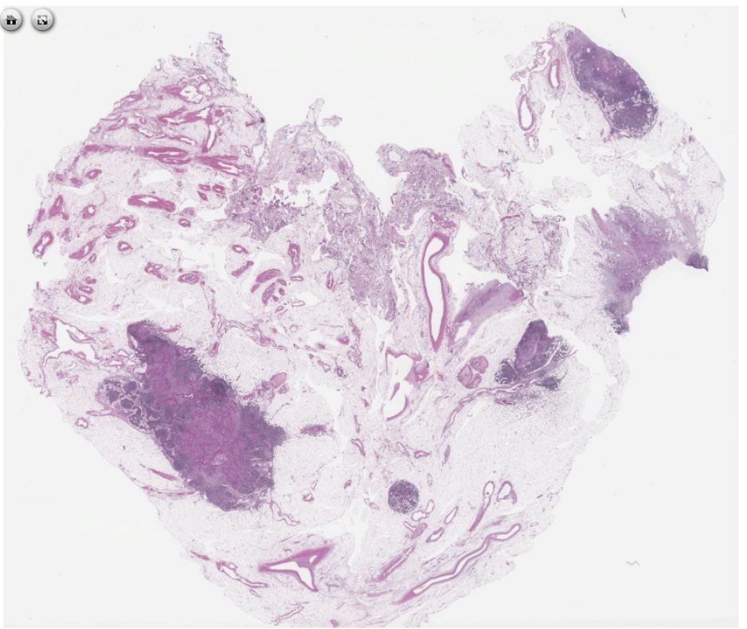
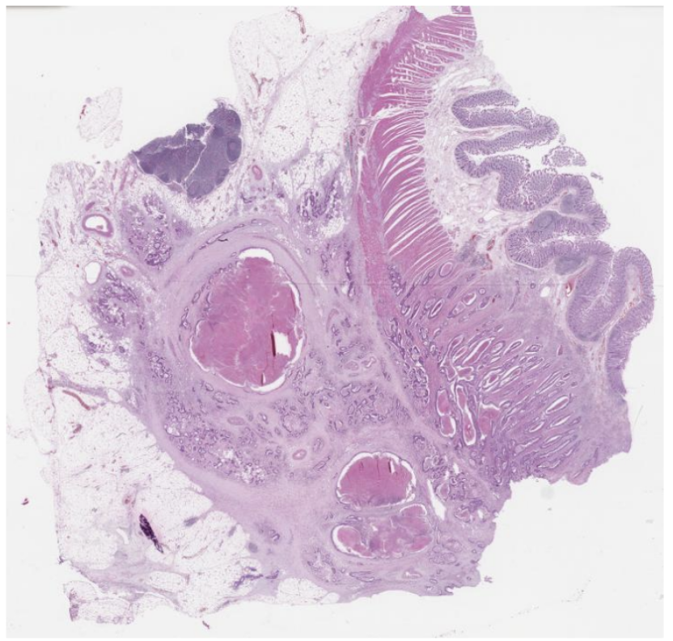
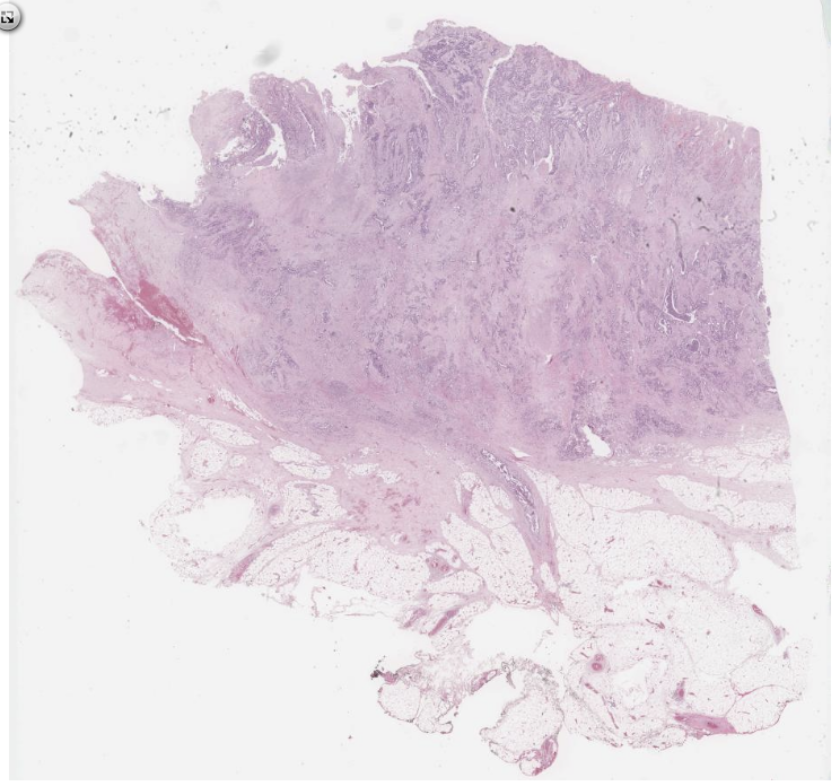

# 28  Ekstramural Venöz İnvazyon

_Organ: Kolon • Lezyon tipi: Ekstramural venöz invazyon_

---

## 28.1 ASI / WSI Görüntüsü

=== "ASI - Link"

    [Tam ekran görüntüleyici ile açmak için tıklayın](https://ornek-ASI-VEYA-WSI-linki.example.com)

    > **Not:** Bu link, tam çözünürlüklü sanal lam görüntüsünü (ASI/WSI) açar. 
    > Öğrenciden beklenen, venöz invazyonu kendisinin bulmaya çalışmasıdır.

=== "Görüntü (PNG/JPG)"

    Aşağıdaki resim, aynı vakadan alınmış ekran görüntüsüdür. 
    Tam ekran görmek için resme tıklayabilirsiniz.

    

---

## 28.2 Morfolojik Özellikler (İşaretli Görüntüler)

Aşağıda **işaretli görüntüler** ve her birinin altında 
ayırıcı morfolojik özellikler yer almaktadır.

**Görsel 1 – Tümörü içeren ven lümeni**

- Oklar, **tümör dolu ven lümenini** göstermektedir.
- Ven duvarı, çevredeki yağ dokusundan ayrılabilen ince duvar yapısıyla seçilmektedir.
- İntravasküler tümör embolisi, hemoraji ile karışmamalıdır.

**Görsel 2 – Ekstramural lokalizasyon**

- Lezyon, **kolon duvarı dışındaki (ekstramural) yağ dokusu** içinde yer almaktadır.
- Aynı vakada, intramural venöz invazyon ile karşılaştırılarak farklar vurgulanabilir.
- Bu bulgu, prognoz ve evreleme açısından kritik öneme sahiptir.

---

## 28.3 Lezyonun Kısa Açıklaması

**Tanım:**  
Ekstramural venöz invazyon, tümörün kolon duvarı dışındaki venöz yapılara 
doğrudan veya emboli şeklinde yayılımını ifade eder.

**Morfolojik Ayırıcı Noktalar:**

- Tümör hücrelerinin **ven lümeni içinde** görülmesi
- Ven duvarının atlanıp **perivasküler yağ dokusu içinde tümör adacıkları** olması
- Sadece lenfatik invazyondan ayrımı için damar duvar yapısının seçilebilmesi

**Patolojik Önemi:**

- Prognoz açısından olumsuz bir histopatolojik bulgudur.
- Evreleme ve adjuvan tedavi kararında kullanılır.
